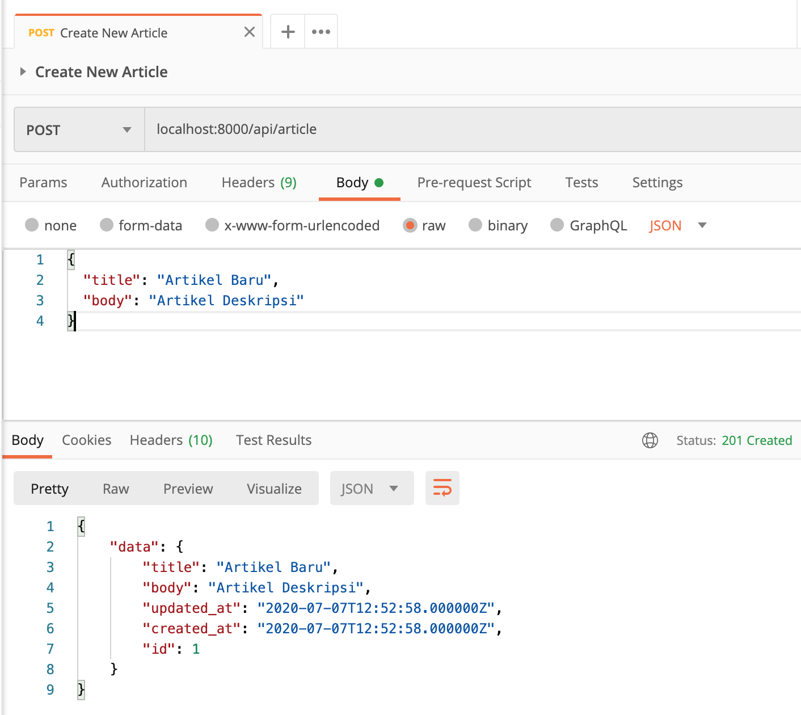
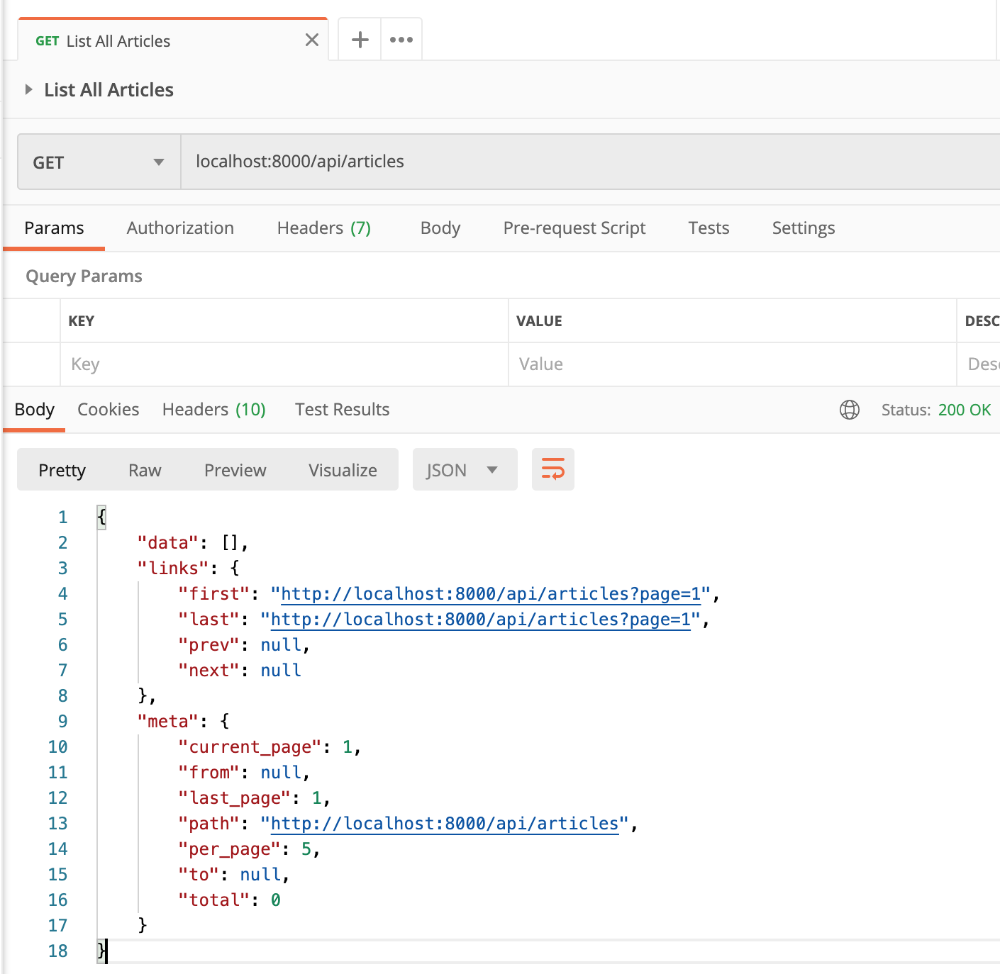
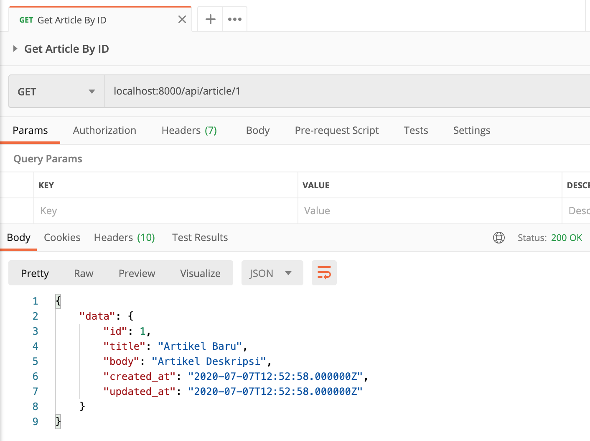
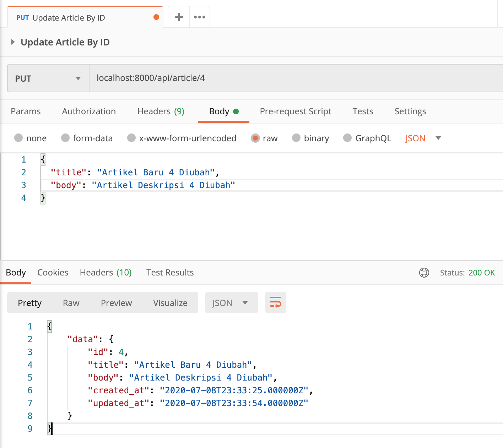
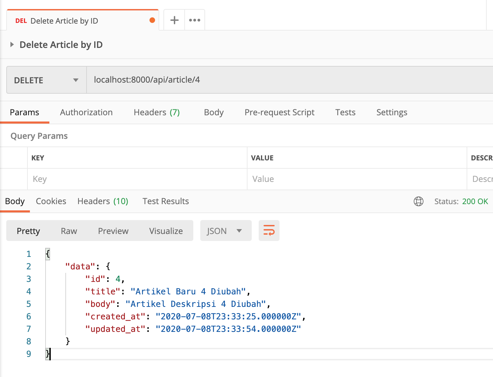

# Laravel API

- Laravel API Huda Prasetyo From Medium

## First Thing First
> Clone / Download first :D

> Change .env.example to .env

> composer update

> php artisan migrate

> composer dump-autoload

> php artisan db:seed --class=ArticlesTableSeeder

> php artisan serve

## Screen shot

Add New Article

List All Articles

Get Article By ID

Update Article By ID

Delete Article By ID

 
